# Kompletní UX/UI Design Document - Pometlaw

## O projektu

Společnost Pometlaw ["pometlo"] "vymetá" (třeba pometlem) staré zavedené postupy v získávání a uveřejňování veřejných zakázek bez zastaralých postupů, které jich zákony nevyžadují. Tento segment více zpřehledňuje, zjednodušuje a srozumitelněji ho interpretuje veřejné správě, administrativním pracovníkům a podnikatelům. Hlavním podnikatelským oborem je tedy vzdělávání, poradenská a administrativní činnost nebo publikace. Na trhu působí seriózním, ale svěžím a čistým dojmem.

## High-Level UI/UX Design

# brand LOGO
path: /img/logo.svg

### Design Philosophy
- **Styl**: Simple, clean, modern design inspirovaný shadcn UI
- **Barevné schéma**: Světlý režim s brand barvami (delft-blue, paynes-gray, moonstone)
- **Komponenty**: Bez stínů, bez hover efektů, čisté linie a hranaté tvary
- **Typografie**: Roboto font family pro konzistentní vzhled
- **Layout**: Responsive grid systém, mobile-first přístup

### Klíčové UX Principy
- **Jednoduchost**: Odstranit zbytečné prvky, zaměřit se na obsah
- **Transparentnost**: Jasná navigace a informace
- **Přístupnost**: Dobrý kontrast, čitelný text, keyboard navigation
- **Performance**: Optimalizované obrázky, lazy loading

### Brand Identity
- **Logo**: Vertikální logo s barevným textem "/img/logo.svg"
- **Tagline**: "Vyčistíme staré postupy pometlem modernosti"
- **Hodnoty**: Inovace, jednoduchost, transparentnost, efektivita

## Sitemap

```mermaid
graph TD
    A[Home] --> B[Hero Section]
    A --> C[Courses Section]
    A --> D[Blog Section]
    A --> E[About Section]
    A --> F[Services Section]
    A --> G[CTA Section]
    A --> H[Next Event Highlight]

    I[Events] --> J[Events Index]
    I --> K[Event Detail]

    L[Contact] --> M[Contact Form]

    N[Navbar] --> O[Logo]
    N --> P[Navigation Links]
    N --> Q[CTA Button]
    N --> R[Mobile Menu]

    S[Footer] --> T[Company Info]
    S --> U[Quick Links]
    S --> V[Contact Info]
    S --> W[Social Links]
```



## Detailed Component Hierarchy

### Layout Components
```
layouts/
├── app.blade.php (main layout)
    ├── navbar.blade.php
    ├── content (yield)
    └── footer.blade.php
```

### Page Components
```
home.blade.php
├── hero-section.blade.php
├── courses-section.blade.php
├── blog-section.blade.php
├── about-section.blade.php
├── services-section.blade.php
├── cta-section.blade.php
└── next-event-highlight.blade.php
```

### UI Components
```
components/ui/
├── button-primary.blade.php
└── button-outline.blade.php
```

### Feature Components
```
components/
├── navbar.blade.php (class-based)
├── footer.blade.php (anonymous)
├── hero-section.blade.php
├── courses-section.blade.php
├── next-event-highlight.blade.php
├── about-section.blade.php
├── blog-section.blade.php
├── services-section.blade.php
└── cta-section.blade.php
```

### Component Props & Data Flow
- **Hero Section**: Přijímá `$upcomingEvents` pro dynamický obsah
- **Courses Section**: Přijímá `$events` pro zobrazení kurzů
- **Next Event Highlight**: Přijímá `$nearestEvent` pro nejbližší událost
- **Navbar**: Class-based komponenta s logikou pro aktivní menu
- **Footer**: Statický obsah s kontaktními informacemi

### Responsive Breakpoints
- **Mobile**: < 768px
- **Tablet**: 768px - 1024px
- **Desktop**: > 1024px

### Color Usage Guidelines
- **Primary**: delft-blue (#2b3756) - hlavní akce, CTA tlačítka
- **Secondary**: paynes-gray (#4A6A82) - doplňkové akce
- **Accent**: moonstone (#65999B) - zvýraznění, success stavy
- **Text Primary**: gray-75 (#3d3d3d)
- **Text Secondary**: gray-50 (#9aa0a6)
- **Background**: white, gray-5 (#f8f9fa), gray-10 (#f1f3f4)
- **Borders**: gray-20 (#e8eaed), gray-30 (#dadce0)

---

## Page-by-Page UX/UI Design Breakdown

### 1. Home Page (`/`)

#### User Stories
- **Jako návštěvník** chci vidět jasnou hodnotovou nabídku společnosti
- **Jako potenciální klient** chci vidět důkazy kvality (recenze, statistiky)
- **Jako zájemce o kurzy** chci vidět přehled dostupných školení
- **Jako čtenář blogu** chci vidět nejnovější články

#### Acceptance Criteria
- [ ] Hero section zobrazuje hlavní hodnotovou nabídku do 3 sekund
- [ ] Recenze jsou viditelné bez scrollování
- [ ] Kurzy jsou zobrazeny s cenami a termíny
- [ ] CTA tlačítka vedou na relevantní stránky
- [ ] Mobilní verze je plně funkční

#### UI Layout
```
┌─────────────────────────────────────┐
│           Navbar                     │
├─────────────────────────────────────┤
│           Hero Section               │
│  ┌─────────────────────────────────┐ │
│  │  Headline + Subheadline        │ │
│  │  Reviews Widget                │ │
│  │  CTA Buttons                   │ │
│  │  Hero Image                    │ │
│  └─────────────────────────────────┘ │
├─────────────────────────────────────┤
│         Courses Section              │
│  ┌─────────────────────────────────┐ │
│  │  Section Title                  │ │
│  │  Course Cards Grid              │ │
│  │  View All Button                │ │
│  └─────────────────────────────────┘ │
├─────────────────────────────────────┤
│         Blog Section                 │
│  ┌─────────────────────────────────┐ │
│  │  Section Title                  │ │
│  │  Blog Cards Grid                │ │
│  └─────────────────────────────────┘ │
├─────────────────────────────────────┤
│         About Section               │
│  ┌─────────────────────────────────┐ │
│  │  Section Title                  │ │
│  │  Feature List + Stats          │ │
│  │  Philosophy Card                │ │
│  └─────────────────────────────────┘ │
├─────────────────────────────────────┤
│         Services Section            │
│  ┌─────────────────────────────────┐ │
│  │  Section Title                  │ │
│  │  Service Cards Grid             │ │
│  └─────────────────────────────────┘ │
├─────────────────────────────────────┤
│         CTA Section                 │
│  ┌─────────────────────────────────┐ │
│  │  Call-to-Action Text            │ │
│  │  CTA Buttons                    │ │
│  └─────────────────────────────────┘ │
├─────────────────────────────────────┤
│     Next Event Highlight            │
│  ┌─────────────────────────────────┐ │
│  │  Event Title + Date             │ │
│  │  Event Description              │ │
│  │  CTA Button                     │ │
│  └─────────────────────────────────┘ │
├─────────────────────────────────────┤
│           Footer                     │
└─────────────────────────────────────┘
```

#### Technical Considerations
- **Performance**: Lazy load obrázky v blog sekci
- **SEO**: Strukturované data pro kurzy a recenze
- **Accessibility**: Alt texty pro všechny obrázky, ARIA labels
- **Mobile**: Stack layout místo grid, zmenšené paddingy

### 2. Events Index Page (`/events`)

#### User Stories
- **Jako zájemce o školení** chci filtrovat kurzy podle kategorie
- **Jako uživatel** chci vidět detailní informace o každém kurzu
- **Jako organizátor** chci vidět kapacitu a dostupnost kurzů

#### Acceptance Criteria
- [ ] Kurzy jsou seřazeny podle data (nejbližší první)
- [ ] Každý kurz zobrazuje cenu, datum, lektory
- [ ] Pagination pro velký počet kurzů
- [ ] Filtry podle kategorie fungují
- [ ] Mobilní karta pro každý kurz

#### UI Layout
```
┌─────────────────────────────────────┐
│           Navbar                     │
├─────────────────────────────────────┤
│         Page Header                  │
│  ┌─────────────────────────────────┐ │
│  │  Page Title                     │ │
│  │  Breadcrumb                     │ │
│  │  Filter Controls                │ │
│  └─────────────────────────────────┘ │
├─────────────────────────────────────┤
│         Events Grid                  │
│  ┌─────────────────────────────────┐ │
│  │  Event Cards                    │ │
│  │  ┌─────────────────────────────┐ │ │
│  │  │ Category Badge              │ │ │
│  │  │ Date                        │ │ │
│  │  │ Title                       │ │ │
│  │  │ Description                 │ │ │
│  │  │ Lecturers                   │ │ │
│  │  │ Price                       │ │ │
│  │  │ CTA Button                  │ │ │
│  │  └─────────────────────────────┘ │ │
│  └─────────────────────────────────┘ │
├─────────────────────────────────────┤
│         Pagination                   │
├─────────────────────────────────────┤
│           Footer                     │
└─────────────────────────────────────┘
```

#### Technical Considerations
- **Database**: Efficient queries s eager loadingem pro lecturers
- **Caching**: Cache filtrovacích výsledků
- **JavaScript**: AJAX pro filtry bez reload
- **Responsive**: Grid se přizpůsobuje (1-3 sloupce)

### 3. Event Detail Page (`/events/{id}`)

#### User Stories
- **Jako zájemce o kurz** chci vidět kompletní informace
- **Jako účastník** chci se registrovat na kurz
- **Jako uživatel** chci sdílet kurz na sociálních sítích

#### Acceptance Criteria
- [ ] Všechny detaily kurzu jsou viditelné
- [ ] Registrační formulář je snadno dostupný
- [ ] Lektor informace jsou kompletní
- [ ] Související kurzy jsou navrženy

#### UI Layout
```
┌─────────────────────────────────────┐
│           Navbar                     │
├─────────────────────────────────────┤
│         Event Header                 │
│  ┌─────────────────────────────────┐ │
│  │  Breadcrumb                     │ │
│  │  Event Title                    │ │
│  │  Category + Date                │ │
│  │  Price                          │ │
│  │  Register Button                │ │
│  └─────────────────────────────────┘ │
├─────────────────────────────────────┤
│         Event Content                │
│  ┌─────────────────────────────────┐ │
│  │  Description                    │ │
│  │  Lecturers Section              │ │
│  │  ┌─────────────────────────────┐ │ │
│  │  │ Lecturer Cards              │ │ │
│  │  │ Photo, Name, Bio             │ │ │
│  │  └─────────────────────────────┘ │ │
│  │  Agenda                         │ │
│  │  Requirements                   │ │
│  └─────────────────────────────────┘ │
├─────────────────────────────────────┤
│         Related Events               │
│  ┌─────────────────────────────────┐ │
│  │  Related Event Cards            │ │
│  └─────────────────────────────────┘ │
├─────────────────────────────────────┤
│           Footer                     │
└─────────────────────────────────────┘
```

#### Technical Considerations
- **SEO**: Rich snippets pro event structured data
- **Social Sharing**: Open Graph meta tags
- **Registration**: AJAX form s validation
- **Caching**: Cache event detail pro performance

### 4. Contact Page (`/contact`)

#### User Stories
- **Jako potenciální klient** chci snadno kontaktovat společnost
- **Jako uživatel** chci vidět kontaktní informace
- **Jako návštěvník** chci vidět mapu s adresou

#### Acceptance Criteria
- [ ] Kontaktní formulář funguje
- [ ] Všechny kontaktní informace jsou viditelné
- [ ] Formulář má validation
- [ ] Success/error messages jsou zobrazeny

#### UI Layout
```
┌─────────────────────────────────────┐
│           Navbar                     │
├─────────────────────────────────────┤
│         Contact Header               │
│  ┌─────────────────────────────────┐ │
│  │  Page Title                     │ │
│  │  Subtitle                       │ │
│  └─────────────────────────────────┘ │
├─────────────────────────────────────┤
│         Contact Content              │
│  ┌─────────────────────────────────┐ │
│  │  Contact Form                   │ │
│  │  ┌─────────────────────────────┐ │ │
│  │  │ Name Field                   │ │ │
│  │  │ Email Field                  │ │ │
│  │  │ Message Field                │ │ │
│  │  │ Submit Button                │ │ │
│  │  └─────────────────────────────┘ │ │
│  │                                 │ │
│  │  Contact Info                   │ │
│  │  ┌─────────────────────────────┐ │ │
│  │  │ Address                      │ │ │
│  │  │ Phone                        │ │ │
│  │  │ Email                        │ │ │
│  │  │ Map                          │ │ │
│  │  └─────────────────────────────┘ │ │
│  └─────────────────────────────────┘ │
├─────────────────────────────────────┤
│           Footer                     │
└─────────────────────────────────────┘
```

#### Technical Considerations
- **Form Handling**: Laravel form request s validation
- **Spam Protection**: Honeypot nebo reCAPTCHA
- **Email**: Queue pro odeslání emailů
- **Map**: Google Maps embed nebo static map

---

## Additional Notes on Technical Considerations

### Frontend Development
- **Framework**: Laravel Blade s Tailwind CSS
- **JavaScript**: Vanilla JS pro interaktivní prvky (mobile menu)
- **Icons**: Lucide icons pro konzistenci
- **Images**: WebP format s fallbacks, lazy loading
- **Performance**: Critical CSS, minifikace, compression

### Backend Integration
- **Data Flow**: Controllers předávají data do komponent
- **Caching**: Redis pro často používaná data
- **API**: RESTful API pro AJAX funkcionality
- **Security**: CSRF protection, input sanitization

### Accessibility (WCAG 2.1 AA)
- **Color Contrast**: Minimum 4.5:1 ratio
- **Keyboard Navigation**: Všechny interaktivní prvky dostupné klávesnicí
- **Screen Readers**: ARIA labels, semantic HTML
- **Focus Management**: Viditelné focus indikátory

### Browser Support
- **Modern Browsers**: Chrome, Firefox, Safari, Edge (poslední 2 verze)
- **Mobile**: iOS Safari, Chrome Mobile
- **Fallbacks**: CSS Grid fallbacks pro starší browsery

### Analytics & Tracking
- **Google Analytics**: Page views, user flow
- **Conversion Tracking**: Form submissions, course registrations
- **Performance Monitoring**: Core Web Vitals

---

## 10 Additional Features & Improvements

### 1. User Dashboard
**Popis**: Osobní dashboard pro registrované uživatele s přehledem jejich kurzů, certifikátů a pokroku.
**Hodnota**: Zlepšuje user experience pro opakované návštěvy.
**Technické požadavky**: Authentication systém, user roles, progress tracking.

### 2. Course Calendar Integration
**Popis**: Kalendář s možností přidat kurzy do osobního kalendáře (Google Calendar, Outlook).
**Hodnota**: Usnadňuje plánování účasti na kurzech.
**Technické požadavky**: iCal export, calendar API integration.

### 3. Live Chat Support
**Popis**: Integrovaný live chat pro okamžitou komunikaci s podporou.
**Hodnota**: Zlepšuje konverzní poměr a customer satisfaction.
**Technické požadavky**: WebSocket nebo third-party service (Intercom, Zendesk).

### 4. Course Rating & Reviews System
**Popis**: Hodnocení kurzů a lektorů s detailními recenzemi.
**Hodnota**: Buduje důvěru a pomáhá při výběru kurzů.
**Technické požadavky**: Rating widget, moderation systém.

### 5. Newsletter Subscription
**Popis**: Inteligentní newsletter s personalizovaným obsahem na základě zájmů.
**Hodnota**: Zlepšuje engagement a udržuje vztah se zákazníky.
**Technické požadavky**: Email service integration (Mailchimp, SendGrid).

### 6. Mobile App
**Popis**: Nativní mobilní aplikace pro iOS a Android s offline přístupem k materiálům.
**Hodnota**: Rozšiřuje dosah a umožňuje learning on-the-go.
**Technické požadavky**: React Native nebo Flutter, API development.

### 7. Advanced Search & Filtering
**Popis**: Pokročilé vyhledávání s filtry podle lokality, ceny, obtížnosti, délky kurzu.
**Hodnota**: Zlepšuje discoverability kurzů.
**Technické požadavky**: Elasticsearch nebo Algolia integration.

### 8. Certificate Generation
**Popis**: Automatické generování certifikátů po dokončení kurzu s QR kódem pro ověření.
**Hodnota**: Zvyšuje hodnotu kurzů a umožňuje sdílení úspěchů.
**Technické požadavky**: PDF generation library, QR code systém.

### 9. Referral Program
**Popis**: Program pro doporučování s odměnami za nové registrace.
**Hodnota**: Organický růst a zvýšení loajality.
**Technické požadavky**: Referral tracking, reward systém.

### 10. Analytics Dashboard for Admins
**Popis**: Komplexní dashboard s metrikami o kurzech, uživatelích a výkonu.
**Hodnota**: Lepší rozhodování a optimalizace businessu.
**Technické požadavky**: Analytics integration, custom reporting.

---

*Tento dokument byl vytvořen jako kompletní UX/UI design guide pro projekt Pometlaw. Všechny specifikace jsou navrženy tak, aby byly implementovatelné v Laravel frameworku s důrazem na clean code a moderní UX principy.*